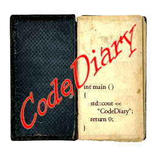

# CodeDiary - v1.1.0



CodeDiary is a simple and small C++ header-only Logger, built using simple template metaprogramming techniques.

## <a name="toc"/> Table of Contents
 * [Table Of Contents](#toc)
 * [Team Members](#team)
 * [Usage](#usage)
 * [Requirements](#requirements)
 * [Building the Samples](#building)
 * [Changelog](#changelog)
 * [TODO](#todo) 
 * [Contributing](#contributing)
 * [Licensing](#licensing)

## <a name="team"/> Team Members
 * "Vlachakis Dimitris" <dimitrisvlh@gmail.com>

## <a name="usage"/> Usage

Just include `Logger.hpp` and you're set!

You can use it to easily manage your logs. By using template metaprogramming techniques, CodeDiary allows you to customize its behavior statically, externally if you wish to do so. You may change the way the log is formatted or where it is printed (file, console, etc...)
The easiest way to use CodeDiary is using its default template arguments like this:

    Logger<>::Log("This is my first log", Logger<>::LogType::DEBUG);

This is by using the default Logger. The output will be:

    Sat Jul 18 08:31:13 2015 DEBUG This is my first log

Instead of using the default Logger you may specify a Formatter or a Dispatcher of your choice. For example:

    // The SampleFormatter is provided in samples/src/SampleFormatter.hpp
    Logger<SampleFormatter>::Log("\\T This is my first log \\L", Logger<SampleFormatter>::LogType::DEBUG);

which will have this as output:

    Sat Jul 18 08:31:13 2015 This is my first log DEBUG

The Logger class takes two templated arguments, a Formatter and a Dispatcher. The Formatter is used to alter the log message accoarding to your needs and the Dispatcher is used to send it to the outer world somehow.
The Formatter has to have one public/protected static member function with this signature:

    static std::string Format(const std::string& msg, const std::string& type)

While the dispatcher has to have one like this:

    static void Dispatch(const std::string& msg)

You can see samples of both Dispatcher and Formatter in Logger.hpp and SampleFormatter.hpp

You can also log your own objects right away if the implement a `std::string ToString()` function. Watch `samples/src/Sample1.cpp' for an example.

**Note:** The `ToString()` method is temporary. In later versions the Logger will be functioning with streams so the `ToString()` will be replaced by the `>> / <<` operators.

## <a name="requirements"/> Requirements
 * Any C++11 compiler (MSVC, Clang++, G++, ...)
 * Python 2.7

## Building <a name="building"/>
There is no point building the library alone since it's header only but to build the test just follow these steps:

 1. Clone the project and cd to the cloned directory.
 2. `cd samples`
 3. Run:  
    ```
    python waf distclean configure --check-c-compiler=<CC> --check-cxx-compiler=<CXX>
    ```  
    where CC and CXX combination can either be {msvc,msvc} | {gcc, g++} | {clang, clang++} and after that run:  
    ```
    python waf clean build install --variant=<VARIANT> --arch=<ARCH>
    ```  
    where VARIANT can be either {Release | Debug} and ARCH can be either {x86 | x64}.
 4. Built binaries will reside in the `bin\<ARCH>\<VARIANT>` directory.

For building I use the [waf build tool](https://github.com/waf-project/waf).

## <a name="changelog"/> Change Log
 
### v1.1.0
 * Reworked Logger design.
   * Now you can use a 3rd parameter to Log immediately an object.
 * Changed directory structure by renaming test folder to samples.
 * Reworked SampleFormatter a bit and moved it to samples folder.

## <a name="todo"/> TODO:
 * Replace strings with {i/o}stream.

## <a name="contributing"/> Contributing
 * For bug fixes, any well checked pull requests are welcome.

## <a name="licensing"/> Licensing

Copyright 2015 Vlachakis Dimitris

Licensed under the Apache License, Version 2.0 (the "License");
you may not use this file except in compliance with the License.
You may obtain a copy of the License at

http://www.apache.org/licenses/LICENSE-2.0

Unless required by applicable law or agreed to in writing, software
distributed under the License is distributed on an "AS IS" BASIS,
WITHOUT WARRANTIES OR CONDITIONS OF ANY KIND, either express or implied.
See the License for the specific language governing permissions and
limitations under the License.

You can also read the license [here](LICENSE).

Copyright (C) 2015 Vlachakis Dimitris <dimitrisvlh@gmail.com>  
All rights reserved.
